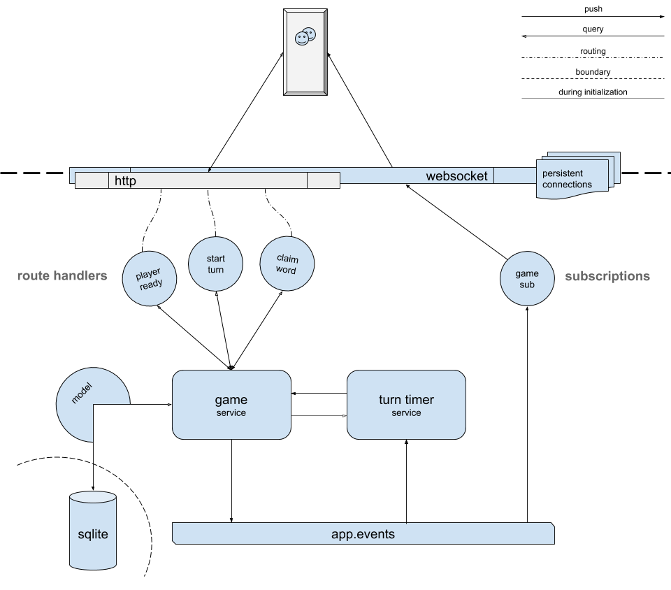

# fishbowl-api
> The REST and realtime backend powering fishbowl

## What is this?
This is a [hapijs](https://hapi.dev/) API web server built using [hapi pal](https://hapipal.com/) to power the fishbowl application.  It supports websockets for realtime functionality in addition to plain HTTP.  The websocket support is made possible by hapi's [nes](https://hapi.dev/module/nes/) plugin.  All game data is persisted to SQLite via [Objection ORM](https://vincit.github.io/objection.js/).

This service may be deployed standalone or treated as a package and pulled-in as a dependency.  When it's used as a dependency, it takes the form of a hapi plugin and may be registered on any existing hapi deployment.  This is exactly how [fishbowl-deployment](../deployment) makes use of this service, deploying both the fishbowl frontend and backend together on a single server.

## Getting Started
### Installation
This service is best installed by running `lerna bootstrap` from the project root.

### Requirements
When deployed standalone, this service only requires it be run on node v12+.  When this package is used as a dependency, the following packages need to be installed in the project as peers: hapi v20, knex v0.21, objection v2, schwifty v6, sqlite3 v5.  With the exception of hapi, these packages are responsible for providing access to the SQLite database.

### Deployment
Once installed you may start the server by running `npm start` within this directory or `lerna run start --stream --scope fishbowl-api` from the project root.  Note that the fishbowl application has its own deployment in the [fishbowl-deployment](../deployment) package, which includes this API service: the instructions above are just for standalone deployments or for development purposes.

When this package is used as a dependency (as it is in fishbowl-deployment), the API service is consumed as a hapi plugin.

### Configuration
This service persists data in an in-memory SQLite database by default.  If you would like to persist data to disk you may provide an environment variable `SQLITE_DB_FILE`.  If you would like to use a .env file for configuration, `cp server/.env-keep server/.env` and fill-in whatever environment variables that you'd like.  The entrypoint to configuration lives in `server/manifest.js`.

When this package is consumed as a hapi plugin it requires no plugin options.  It assumes that schwifty will be registered by the root server and configured with a knex instance (providing an interface to the database), as it is here within `server/`.

## Architecture

> Data flow and architecture of the fishbowl API

Here's what a typical roundtrip looks like to change the state of a game of fishbowl for all players:

1. The client subscribes to updates for a specific game over a websocket.
2. When the client wants to take an action in the game, they send a websocket message indicating their intent, i.e. "player ready."
3. That message is routed to a hapi [route handler](./lib/routes/game-player-ready.js) and authenticated with the help of [nes](https://hapi.dev/module/nes/) and standard [hapi auth](./lib/auth/strategies/player.js).
4. The route handler calls into the [game service](./lib/services/game.js), invoking the appropriate [game mutation](https://github.com/devinivy/fishbowl/blob/0dc843d80ad07fef9a1a3eafbe89a1f5ed0845e9/packages/api/lib/services/game.js#L112-L134).
5. The game service persists the change to game state through the model, which is based on [Objection ORM](https://vincit.github.io/objection.js/).  This data is stored in SQLite.
6. If the change to game state is transactionally successful, an event [`game-updated` is emitted](https://github.com/devinivy/fishbowl/blob/0dc843d80ad07fef9a1a3eafbe89a1f5ed0845e9/packages/api/lib/services/game.js#L34) to hapi's in-process event bus.
7. The `game-updated` event triggers a [nes subscription](./lib/subscriptions/game.js), which publishes the updated game state to each of the active websocket subscribers, including the client who sent the original message in step #2.
   - Each websocket listener has the updated game state [catered to them](https://github.com/devinivy/fishbowl/blob/0dc843d80ad07fef9a1a3eafbe89a1f5ed0845e9/packages/api/lib/subscriptions/game.js#L12-L23) based upon their auth credentials.
8. The clients receive the updated game state and use that to update their UIs.
